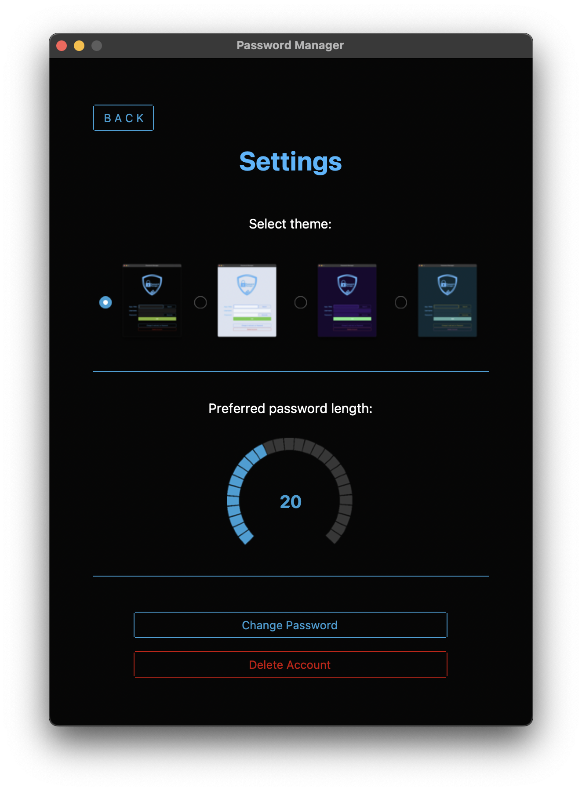
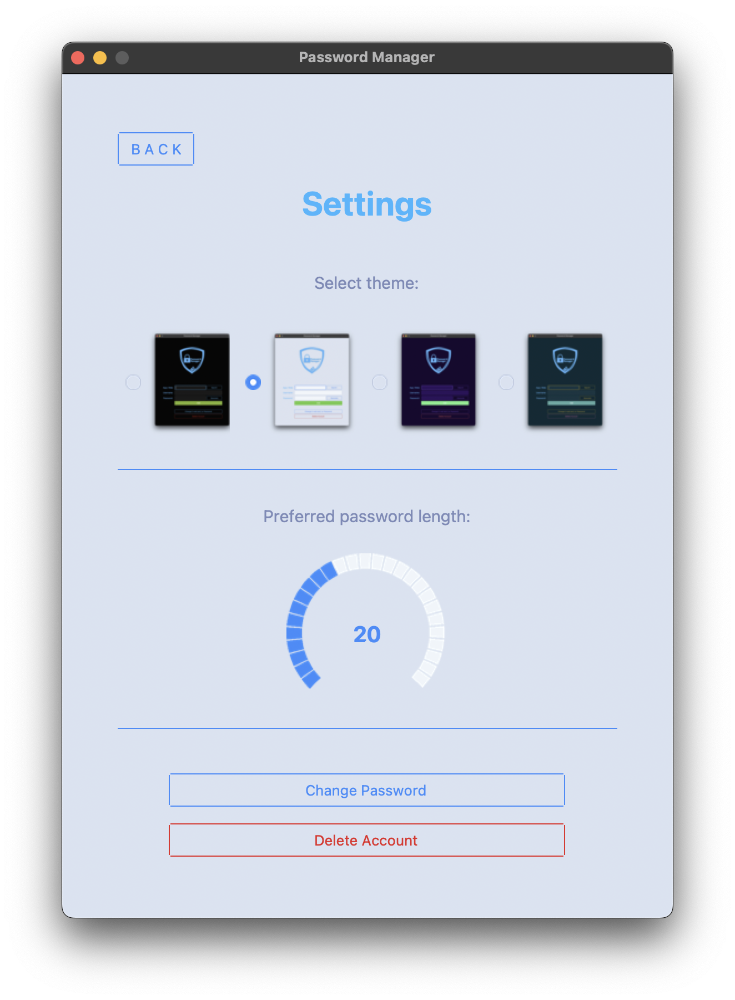

# V13 Password Manager

## Table of Contents
- [Description](#description)
- [Features](#features)
- [Setup and Usage](#setup-and-usage)
- [License](#license)
- [Demo Images](#demo-images)

## Description
Simple password management application developed using Python's Object-Oriented Programming (OOP) 
principles and following the Model-View-Controller (MVC) architecture. The graphical user interface (GUI) is built 
using [tkinter](https://docs.python.org/3/library/tkinter.html) and 
[ttkbootstrap](https://pypi.org/project/ttkbootstrap/), ensuring an intuitive and modern user experience.

The application utilizes [bcrypt](https://pypi.org/project/bcrypt/) for securely hashing master password and 
[cryptography](https://pypi.org/project/cryptography/) for encrypting and decrypting stored passwords. 
All sensitive data, including master password, salt, cryptography Fernet key and 
[pyotp](https://pypi.org/project/pyotp/) key, are securely stored in the system's 
[keyring](https://pypi.org/project/keyring/) separately from database with all saved credentials.

During account creation, users are prompted to provide an email address for authentication. A one-time password 
(OTP) is sent to the provided email for verification, ensuring the legitimacy of the account creation process. 
This OTP expires after 60 seconds, adding an extra layer of security. Users are then guided through setting up 
a strong master password and enabling two-factor authentication (2FA) using Google Authenticator or a similar app.

Upon successful account creation, users can log in using their master password and the configured authenticator app. 
For added security, master passwords and 2FA settings can be reset via email.

Once logged in, users can securely save and retrieve credentials, generate strong and unique passwords, and manage 
their saved applications or web pages. In the settings page, users have the flexibility to customize their 
experience by changing the application theme, adjusting password length requirements, and deleting their 
account if needed.

To further enhance security, the application automatically logs out users if idle for more than 5 minutes, 
ensuring data protection even when the application is left unattended.

> [!CAUTION]
> **Please note that while this password manager incorporates some security measures, it is primarily developed for learning 
> purposes and do not offer the same level of security as commercial-grade password managers. Exercise caution and 
> understand the limitations before entrusting it with sensitive information.**

## Features

* **Security Measures**: Application uses bcrypt for master password salting and hashing. All secrets related to 
account are stored in keyring separately from saved credentials. Credentials are stored in database and passwords 
are stored encrypted using cryptography.
* **Email Verification**: Ensures the authenticity of user-provided email address by sending a time limited 
one-time password (OTP) for verification.
* **Two-Factor Authentication (2FA)**: Enhances security with 2FA setup using Google Authenticator or similar 
app, adding an extra layer of protection to user accounts.
* **Master Password**: Users are prompted to create a strong master password during account setup to 
safeguard their accounts.
* **Password Generation**: Provides functionality to generate strong and secure passwords, ensuring users 
have access to reliable password generation.
* **Database Storage**: Stores credentials in database.
* **Customizable Settings**: Allows users to customize application settings such as theme selection and 
password length according to their preferences.
* **Automatic Logout**: Implements an automatic logout feature that logs out users after a specified period of 
inactivity, enhancing security.

## Setup and Usage

1. Ensure Python 3 is installed on your system.
2. Clone this repository using: `git clone https://github.com/visualsThirteen/v13-password-manager.git`.
3. Install the required dependencies using: `pip install -r requirements.txt`.
4. [Setup e-mail configuration.](#setup-e-mail-configuration)
5. Change directory to v13pwm package folder: `cd v13pwm`.
6. Run program using: `python v13pwm.py`

### Setup E-mail Configuration

This program sends OTP (One Time Password) via e-mail to authenticate user entered e-mail address. 
To be able to run and test this application, it is necessary to set up applications e-mail configuration with your 
own e-mail.

Inside `mail_processor.py` file:

```python
    class MailProcessor:

        EMAIL = os.environ["EMAIL"]
        PASSWORD = os.environ["PASSWORD"]
        SMTP_SERVER = "smtp.gmail.com"
        SMTP_PORT = 587
```

1. Set EMAIL to your e-mail address.
2. Set PASSWORD to your e-mails Application-Specific Password 
([How to Create Application-Specific Password](#how-to-create-application-specific-password))
3. Set SMTP_SERVER to your e-mail providers smtp server ([Common SMTP servers](#common-smtp-servers-))

### How to Create Application-Specific Password

To send emails using SMTP (Simple Mail Transfer Protocol) with popular email providers like Gmail, Outlook, 
Yahoo, iCloud Mail or ProtonMail you typically need to use an "App Password" or "Application-Specific Password" 
instead of your regular email password. This is a security measure implemented by e-mail providers 
to protect your account.

**Here's how you can obtain an App Password for each of these popular email providers:**
* [Gmail](#gmail-)
* [Outlook](#outlook-)
* [Yahoo](#yahoo-)
* [iCloud Mail](#icloud-mail-)
* [ProtonMail](#protonmail-)

#### Gmail:
1. **Enable Two-Factor Authentication (2FA)**:
    * Go to your Google Account settings: https://myaccount.google.com/security.
    * Under "Signing in to Google," select "2-Step Verification" and follow the instructions to set up 2FA if you 
   haven't already.
2. **Generate an App Password**:
    * After enabling 2FA, scroll down to the "App passwords" section.
    * Select "App passwords" and sign in again if prompted.
    * Choose the app you're using and the device you're using it on, then select "Generate."
    * Follow the instructions to enter the App Password in application.

#### Outlook:
1. **Enable Two-Step Verification**:
    * Go to your Microsoft Account settings: https://account.microsoft.com/security/.
    * Under "Security," select "Advanced security options."
    * Follow the instructions to enable Two-Step Verification if you haven't already.
2. **Create an App Password**:
    * After enabling Two-Step Verification, go back to the "Security" page.
    * Under "App passwords," select "Create a new app password."
    * Follow the instructions to create and use the app password for application.

#### Yahoo:
1. **Enable Two-Step Verification**:
    * Go to your Yahoo Account settings: https://login.yahoo.com/account/security.
    * Under "Account security," turn on Two-Step Verification if you haven't already.
2. **Generate an App Password**:
    * After enabling Two-Step Verification, scroll down to the "App passwords" section.
    * Select "Generate password" and follow the instructions to create an App Password.
    * Use this password when setting up application to send emails.

#### iCloud Mail:
1. **Generate App-Specific Password**:
    * Go to your Apple ID account page: https://appleid.apple.com/.
    * Sign in and navigate to the "Security" section.
    * Under "APP-SPECIFIC PASSWORDS," click on "Generate Password."
    * Enter a label for the password (e.g., "SMTP") and click "Create."
    * Use the generated password when setting up application to send emails.

#### ProtonMail:
1. **Generate Bridge Password (for ProtonMail Bridge users)**:
    * Open the ProtonMail Bridge application on your computer.
    * Go to "Settings" > "Bridge" and click on "Generate new bridge password."
    * Use the generated bridge password when setting up application to send emails through ProtonMail.

Remember to keep your App Password secure and never share it with anyone. These passwords are specific to 
the application you're using and are different from your regular email password. If you're using a different 
email provider, check their documentation or security settings for instructions on generating App Passwords.

### Common SMTP servers:
**Gmail**:
* SMTP Server: smtp.gmail.com

**Outlook**:
* SMTP Server: smtp.office365.com

**Yahoo**:
* SMTP Server: smtp.mail.yahoo.com

**iCloud Mail**:
* SMTP Server: smtp.mail.me.com

**ProtonMail**:
* SMTP Server: smtp.protonmail.ch

Always refer to the latest documentation from the email provider for any updates or changes to their SMTP 
server settings.

## License

This project is licensed under the MIT License.

## Demo Images






